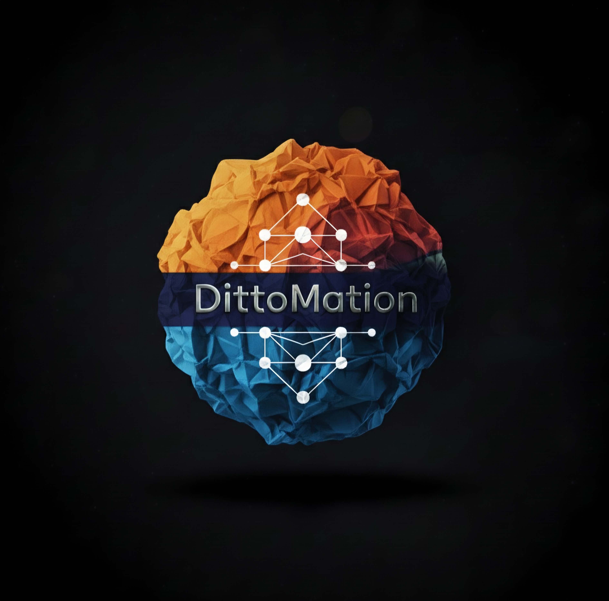

<p align="center">
  
</p>

<h1 align="center">DittoMation</h1>

<p align="center">
  <strong>Smart Android Automation with Natural Language Commands</strong>
</p>

<p align="center">
  <a href="https://github.com/OmPrakashSingh1704/DittoMation/stargazers"></a>
  <a href="https://github.com/OmPrakashSingh1704/DittoMation/network/members"></a>
</p>

<p align="center">
  <a href="https://pypi.org/project/dittomation/"></a>
  <a href="https://pypi.org/project/dittomation/"></a>
  <a href="https://github.com/OmPrakashSingh1704/DittoMation/actions/workflows/ci.yml"></a>
  <a href="https://opensource.org/licenses/MIT"></a>
</p>

<p align="center">
  <a href="https://omprakashsingh1704.github.io/DittoMation/demo/">Try Interactive Demo</a> •
  <a href="https://omprakashsingh1704.github.io/DittoMation/">Documentation</a> •
  <a href="#quick-start">Quick Start</a> •
  <a href="#features">Features</a>
</p>

---

## Why DittoMation?

Traditional Android automation breaks constantly:

| Problem | Coordinate-based | DittoMation |
|---------|------------------|-------------|
| Screen size changes | **Breaks** | Works |
| UI layout updates | **Breaks** | Works |
| Element ID renamed | **Breaks** | Works |
| **Success Rate** | ~70% | **~98%** |

**DittoMation uses smart element location** with multiple fallback strategies, so your automation scripts keep working even when the UI changes.

---

## Interactive Demo

**[Try DittoMation in your browser](https://omprakashsingh1704.github.io/DittoMation/demo/)** - no installation required!

Type natural language commands and watch them execute on a simulated Android device.

---

## Quick Start

### Installation

```bash
pip install dittomation
```

### Your First Command

```bash
# Natural language - just describe what you want
ditto nl "open YouTube, search for cats, play first video"
```

### Or Use Python

```python
from dittomatic import DittoMation

ditto = DittoMation()
ditto.run("open settings and enable dark mode")
```

---

## Features

### Natural Language Commands

Control your Android device with plain English:

```bash
ditto nl "Open Chrome, search for weather, tap first result"
ditto nl "Set alarm for 7:30 am"
ditto nl "Call mom and wait 30 seconds"
```

### Smart Locator

Never worry about brittle selectors again. DittoMation automatically tries multiple strategies:

```
resource-id → content-desc → text → xpath → visual AI → coordinates
```

### Record & Replay

```bash
# Record your actions
ditto record --output my_workflow.json

# Replay anywhere
ditto run my_workflow.json
```

### Variables & Control Flow

```json
{
  "variables": { "username": "testuser" },
  "steps": [
    { "action": "tap", "text": "Login" },
    { "action": "type", "value": "{{username}}" },
    { "action": "if", "expr": "element_exists(text='Welcome')",
      "then_steps": [{ "action": "log", "message": "Success!" }]
    }
  ]
}
```

---

## Full Feature List

- **Record** touch gestures (tap, swipe, long press, scroll, pinch)
- **Replay** recorded workflows with smart element location
- **Natural Language** - describe actions in plain English
- **Smart Locators** - fallback chain for reliable element finding
- **Intent-based App Launching** - reliable app opening
- **Variables & Expressions** - dynamic scripts with `{{variable}}` syntax
- **Control Flow** - if/else conditions, for/while/until loops
- **Cloud Ready** - AWS Device Farm & Firebase Test Lab support

---

## Supported Commands

| Command | Example |
|---------|---------|
| Open app | `open YouTube` |
| Tap element | `tap Login button` |
| Type text | `type "hello world"` |
| Swipe | `swipe up`, `swipe left` |
| Scroll | `scroll down` |
| Long press | `long press Settings` |
| Search | `search for "cats"` |
| Navigate | `back`, `home` |
| Wait | `wait 5 seconds` |
| Call | `call 1234567890` |
| Set alarm | `set alarm for 8:00` |

---

## Installation Options

### From PyPI (Recommended)

```bash
pip install dittomation
```

With cloud provider support:

```bash
pip install dittomation[aws]      # AWS Device Farm
pip install dittomation[firebase] # Firebase Test Lab
pip install dittomation[all]      # All extras
```

### From Source

```bash
git clone https://github.com/OmPrakashSingh1704/DittoMation.git
cd DittoMation
pip install -e .
```

### Requirements

- Python 3.8+
- Android SDK with ADB
- Android device/emulator with USB debugging enabled

---

## Documentation

- [Getting Started Guide](https://omprakashsingh1704.github.io/DittoMation/getting-started/)
- [Smart Locator](https://omprakashsingh1704.github.io/DittoMation/features/smart-locator/)
- [Natural Language](https://omprakashsingh1704.github.io/DittoMation/features/natural-language/)
- [Record & Replay](https://omprakashsingh1704.github.io/DittoMation/features/record-replay/)
- [Variables & Control Flow](https://omprakashsingh1704.github.io/DittoMation/variables-and-control-flow/)

---

## Contributing

Contributions are welcome! Please see [CONTRIBUTING.md](CONTRIBUTING.md) for guidelines.

---

## Support

- [GitHub Issues](https://github.com/OmPrakashSingh1704/DittoMation/issues) - Bug reports & feature requests
- [Interactive Demo Feedback](https://omprakashsingh1704.github.io/DittoMation/demo/#feedback) - Share your thoughts

---

## License

MIT License - see [LICENSE](LICENSE) for details.

---

<p align="center">
  <strong>If DittoMation helps you, please consider giving it a star!</strong><br>
  <a href="https://github.com/OmPrakashSingh1704/DittoMation/stargazers">
    
  </a>
</p>
